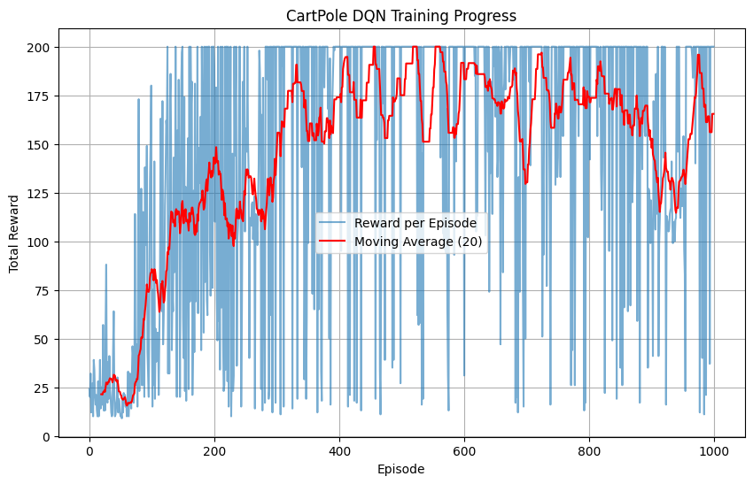

# 🧠 Deep Q‑Network (DQN) on CartPole

An implementation of a Deep Q‑Network (DQN) in PyTorch, trained to solve the classic **CartPole‑v1** environment from OpenAI Gym. The agent learns to balance the pole by approximating Q‑values with a neural network, using experience replay and a target network for stability.

---

## 🎥 Results

Here’s the trained agent balancing the pole:

[▶️ Watch full video](results/videos/cartpole_dqn.mp4)

---

## 📈 Training Progress



- The agent starts with random play (low rewards).  
- Over time, it learns to balance longer, with rewards approaching the maximum of 200.  
- Occasional spikes/drops reflect exploration during training.

---

## ⚙️ How It Works

- **Replay Buffer**: Stores past experiences `(state, action, reward, next_state, done)` and samples random minibatches for training.  
- **Bellman Update**: Targets are computed as  
  y = r + γ * max_a' Q_target(s', a')  
- **Target Network**: A copy of the Q‑network updated periodically to stabilize training.  
- **Epsilon‑Greedy Exploration**: Balances exploration vs. exploitation by decaying ε over time.

---

## 🚀 Getting Started

### Installation
```

bash
git clone https://github.com/yourusername/dqn-cartpole.git
cd dqn-cartpole
pip install -r requirements.txt
```

### Training
```bash
python train.py
```
### Watching the Agent
# If you want to see the trained agent play, run the following inside your notebook
# or modify train.py to load a saved model and call env.render():
# Example (inside Python):
#   model.load_state_dict(torch.load("checkpoints/dqn_cartpole.pth"))
#   state, _ = env.reset()
#   for _ in range(200):
#       action = model(torch.tensor(state, dtype=torch.float32).unsqueeze(0)).argmax().item()
#       state, reward, done, _, _ = env.step(action)
#       env.render()
#       if done: break
---

## 📚 What I Learned

- How to implement a replay buffer and use it for stable training.  
- Why target networks are essential to prevent divergence.  
- How the Bellman equation translates into a neural network update.  
- Debugging PyTorch models and handling Gym’s evolving API.  

---

## 🔮 Next Steps

- Extend to **Double DQN** to reduce overestimation bias.  
- Try **LunarLander‑v2** for a harder control task.  
- Add **Prioritized Experience Replay** for more efficient learning.  

---

## 🙌 Acknowledgments

- OpenAI Gym for the CartPole environment.  
- PyTorch for the deep learning framework.  
- DeepMind’s original DQN paper for inspiration.  
